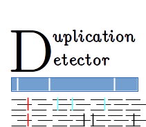

# SYNOPSIS

**duplicationDetector** is an accurate and very fast tool to easily and successfully detect duplicated genes or regions in any autogamous species. It relies on the abnormal number of heterozygous in a given interval for an autogamous (and thus highly homozygous) species. In addition, it does not need another large computational time as it will use classical output of NGS SNP analysis, the VCF file.

The input files of this software is a raw VCF generated after common NGS data analysis, as well as a GFF file of the reference genome. The full analysis is performed in three steps.

The first step will recover the abnormaly heterozygous points, using the *perl* script *vcf_filter.pl*. User can specify at this step the minimal depth, the maximum number of abnormally map reads (MQ0 value), as well as the minimum number of individuals to be heterozygous for the point to be considered. In addition, user can request some individuals to be homozygous (controls).

In the second step, the previously selected points are combined into genomic intervals with *genomic_interval_position.pl* script. User can define the minimal size of intervals, as well as the maximal distance between 2 points to be linked and the minimal number of points per kb for the interval to be conserved.

The last optional step consists in crossing the genomic intervals obtained in the previous step with an annotated genome data base using the *intersectBed* from the **BEDtools** suite, in order to evidence the duplicated genes.

While each steps can be launched independantly, the *duplicationDetector.pl* script can be used to launch the complete analysis directly.

# CITATION

Please cite:

Gustave Djedatin, Cécile Monat, Stefan Engelen, Francois Sabot, *DuplicationDetector*, a light weight tool for duplication detection using NGS data. **Current Plant Biology**, Volumes 9–10, 2017, Pages 23-28, ISSN 2214-6628, https://doi.org/10.1016/j.cpb.2017.07.001.
(http://www.sciencedirect.com/science/article/pii/S2214662817300476)

# REQUIREMENTS
* Linux 64bits system
* Perl 5.xx
* BEDtools

# INSTALLATION
Clone the current version of the deposit

````
git clone https://github.com/SouthGreenPlatform/duplicationDetector
````

Or download the current version at https://github.com/SouthGreenPlatform/duplicationDetector/releases

That's it!

# MANUAL
Usage:

````
perl /path/to/duplicationDetector.pl -i VCFIn -o fileOut
  [-c control homozygous list
   -g gff file
   -d depth
   -H nbHzExpected
   -M MQ0Expected
   -m missingData
   -s maximum size between 2 points
   -b minimal block size
   -D minimal block density]
````

Control homozygous list will be ReadGroup separated by commas (ex Ind1,Ind2)

Defaults value are -d 30 -H 8 -M 0 -m 2 -D 25 -b 100 -s 1000 -c undef -g undef;

# CONTACTS

gustave.djedatin-at-ird.fr

francois.sabot-at-ird.fr
